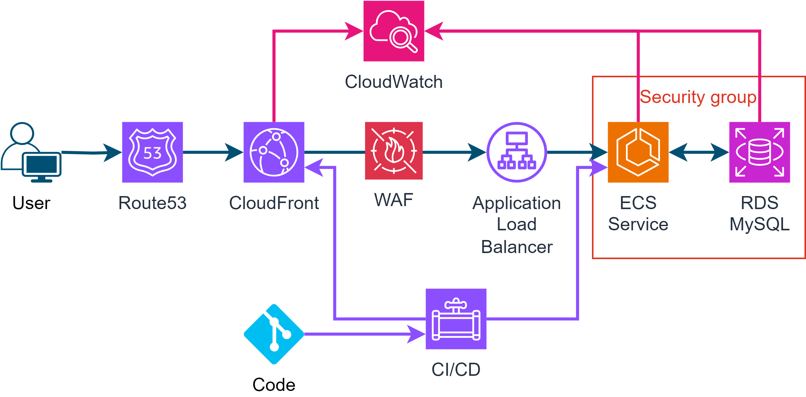

<h1 align="center">
    PHP Clients CRUD
</h1>

### Cloud Suggestion

 

<!-- GETTING STARTED -->
## Getting Started

To get a local copy up and running follow these simple example steps.

### Installation Client

1. Clone the repo
   ```sh
   git clone https://github.com/paulofelipebrito/php-test
   ```
2. Open client folder
   ```sh
   cd client 
   ```
3. Install yarn packages
   ```sh
   yarn 
   ```
3. Create .env following .env.example and add url to server (ex: http://localhost:8000/api)

4. Start the app with yarn
   ```sh
   yarn dev 
   ```   
5. Visit `http://localhost:5173/` on your browser

### Installation Server

1. Clone the repo
   ```sh
   git clone https://github.com/paulofelipebrito/php-test
   ```
2. Open server folder
   ```sh
   cd server 
   ```
3. Create .env following .env.example and add mysql configuration

4. Configure php
  
5. Update migrations
   ```sh
   php artisan migrate 
   ```
   
6. Seed database
   ```sh
   php artisan db:seed
   ```
   
 7. Start the project 
   ```sh
   php artisan serve
   ```

 8. If you want to run test, run:
   ```sh
   php artisan test
   ```
